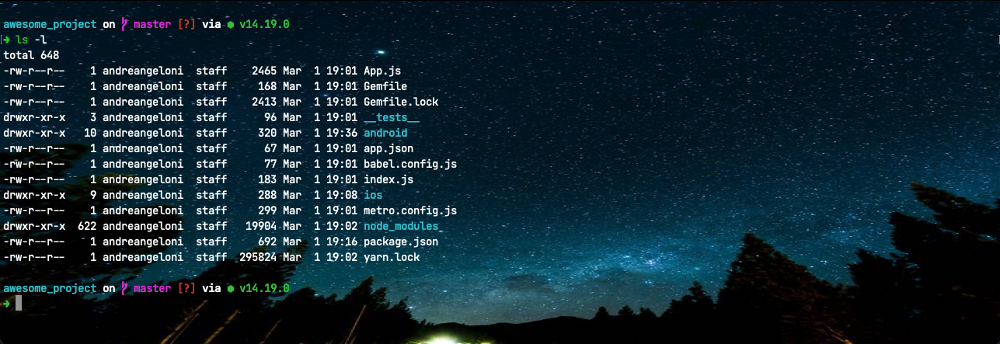

# Setup Oh My ZSH on macOS

Open terminal and run the following commands:

## Installing Oh My ZSH
```bash
sh -c "$(curl -fsSL https://raw.github.com/ohmyzsh/ohmyzsh/master/tools/install.sh)"
```

## Plugins
### Syntax Highlighting
```bash
git clone https://github.com/zsh-users/zsh-syntax-highlighting.git ${ZSH_CUSTOM:-~/.oh-my-zsh/custom}/plugins/zsh-syntax-highlighting
```

### Auto Suggestions
```bash
git clone https://github.com/zsh-users/zsh-autosuggestions ${ZSH_CUSTOM:-~/.oh-my-zsh/custom}/plugins/zsh-autosuggestions
```

## Spaceship Theme
```bash
git clone https://github.com/spaceship-prompt/spaceship-prompt.git "$ZSH_CUSTOM/themes/spaceship-prompt" --depth=1
ln -s "$ZSH_CUSTOM/themes/spaceship-prompt/spaceship.zsh-theme" "$ZSH_CUSTOM/themes/spaceship.zsh-theme"
```

## Setup
Run `code ~/.zshrc` to open .zshrc file on VS Code. <br />
Find the respectives lines and replace the code below:
- Set `ZSH_THEME="spaceship"`
- Set `plugins=(git zsh-syntax-highlighting zsh-autosuggestions)`

Close terminal and open again for changes to be applied.

## Bonus

- Go to Terminal > Preferences > Profiles > Text: <br />
Change background image <br />
<i>You can download the image is available in this repo or feel free to use another that you liked.</i>

- Go to Terminal > Preferences > Profiles > Advanced: <br />
Uncheck `Allow VT100 application keypad mode` to use numeric pad on extended keyboard.

## Result
Your terminal should be like that:

<p align="center">
  
</p>